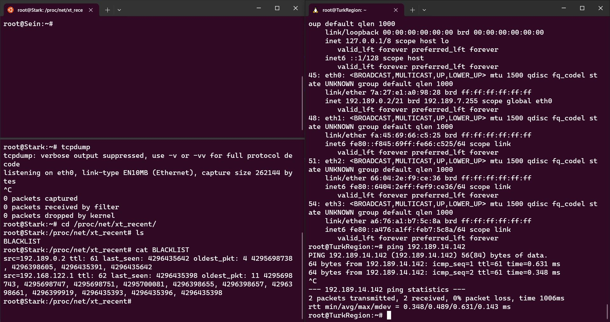

# Jarkom-Modul-5-B22-2023

## SETUP

Topologi:


Pembagian IP:


### DHCP

Installasi DHCP Relay di Heiter dan Himmel untuk forward request ke Revolte

**Kesulitan :**
- Stuck karena pada relay "Heiter", harus menambah eth0 pada daftar interface padahal tidak perlu di relay "Himmel" & tidak ada client yang dilayani di eth0
  

### 1
Agar topologi yang kalian buat dapat mengakses keluar, kalian diminta untuk mengkonfigurasi Aura menggunakan iptables, tetapi tidak ingin menggunakan MASQUERADE.

Pertama, dilakukan pengumpulan untuk ip ip yang dibutuhkan

```
ETH0_IP=$(ip -4 addr show eth0 | grep -oP '(?<=inet\s)\d+(\.\d+){3}')
```
```ip -4 addr show eth0``` digunakan untuk menampilkan informasi konfigurasi antarmuka `eth0` dan memastikan bahwa hanya alamat IPv4 yang ditampilkan.
Kemudian, untuk hanya menangkap ipnya saja seperti `192.189.0.0`, maka dilakukan filter atau grep ```'(?<=inet\s)\d+(\.\d+){3}'```.

Setelah itu dilakukan konfigurasi menggunakan iptables berikut:
```
iptables -t nat -A POSTROUTING -o eth0 -j SNAT --to-source $ETH0_IP
```


### 2
Kalian diminta untuk melakukan drop semua TCP dan UDP kecuali port 8080 pada TCP.

Pertama akan dilakukan flsuh iptables untuk menghapus semua chain dalam aturan iptables:
```
iptables -F

iptables -A INPUT -p icmp -j ACCEPT

iptables -A INPUT -p tcp --dport 8080 -j ACCEPT
```
Dan dalam hal tersebut juga dilakukan perizinan untuk melaukan ping maupun lalu lintas melalui tcp atau port 8080.
Sedangkan di luar itu akan ditolak:
```
iptables -A INPUT -p tcp -j DROP

iptables -A INPUT -p udp -j DROP

```


### 3
Kepala Suku North Area meminta kalian untuk membatasi DHCP dan DNS Server hanya dapat dilakukan ping oleh maksimal 3 device secara bersamaan, selebihnya akan di drop.
```
iptables -A INPUT -m state --state ESTABLISHED,RELATED -j ACCEPT

iptables -A INPUT -p icmp -m connlimit --connlimit-above 3 --connlimit-mask 0 -j DROP

```


### 4
Lakukan pembatasan sehingga koneksi SSH pada Web Server hanya dapat dilakukan oleh masyarakat yang berada pada GrobeForest.
```
iptables -A INPUT -p tcp --dport 22 -s 192.189.8.0/22 -j ACCEPT

iptables -A INPUT -p tcp --dport 22 -j DROP
```


### 5
Selain itu, akses menuju WebServer hanya diperbolehkan saat jam kerja yaitu Senin-Jumat pada pukul 08.00-16.00.
```
iptables -A INPUT -p tcp --dport 22 -s 192.189.8.0/22 -m time --timestart 08:00 --timestop 16:00 --weekdays Mon,Tue,Wed,Thu,Fri -j ACCEPT

iptables -A INPUT -p tcp --dport 22 -j DROP
```


### 6
Lalu, karena ternyata terdapat beberapa waktu di mana network administrator dari WebServer tidak bisa stand by, sehingga perlu ditambahkan rule bahwa akses pada hari Senin - Kamis pada jam 12.00 - 13.00 dilarang (istirahat maksi cuy) dan akses di hari Jumat pada jam 11.00 - 13.00 juga dilarang (maklum, Jumatan rek).
```
iptables -A INPUT -p tcp --dport 22 -s 192.189.8.0/22 -m time --timestart 12:00 --timestop 13:00 --weekdays Mon,Tue,Wed,Thu -j DROP

iptables -A INPUT -p tcp --dport 22 -s 192.189.8.0/22 -m time --timestart 11:00 --timestop 13:00 --weekdays Fri -j DROP
```


### 7 - https://scalingo.com/blog/iptables

##### DNAT

Melakukan DNAT untuk setiap paket ke-2 yang memenuhi syarat soal agar menuju ke server yang lain.

**Heiter**
```
iptables -A PREROUTING -t nat -p tcp -d 192.189.8.2 --dport 80 \
         -m statistic --mode nth --every 2 --packet 0              \
         -j DNAT --to-destination 192.189.14.142:80
```
**Himmel**

```
iptables -A PREROUTING -t nat -p tcp -d 192.189.14.142 --dport 443 \
         -m statistic --mode nth --every 2 --packet 0              \
         -j DNAT --to-destination 192.189.8.2:443
```

##### SNAT

Melakukan SNAT untuk paket yang diredirect agar datang dari interface router yang tepat.

**Heiter**
```
iptables \
  -A POSTROUTING \
  -t nat \
  -p tcp \
  -d 192.189.8.2   \
  --dport 80  \
  -j SNAT     \
  --to-source  192.189.14.141
```
**Himmel**
```
iptables \
  -A POSTROUTING \
  -t nat \
  -p tcp \
  -d 192.189.14.142   \
  --dport 80  \
  -j SNAT   \
  --to-source  192.189.8.1
```


### 8

Menggunakan modul time untuk DROPPING paket di antara tanggal pemilu presiden sesuai website kpu.


**Heiter**
```
iptables -N DROPPING
iptables -A FORWARD -s 192.189.14.150 -d 192.189.8.2 -m time --datestart 2023-11-28 --datestop 2024-03-20 -j DROPPING
iptables -A DROPPING -j LOG --log-prefix "IPTables-Dropped: " --log-level 4
iptables -A DROPPING -j DROP
```
**Himmel**
```
iptables -N DROPPING
iptables -A FORWARD -s 192.189.14.150 -d 192.189.14.142 -m time --datestart 2023-11-28 --datestop 2024-03-20 -j DROPPING 
iptables -A DROPPING -j LOG --log-prefix "IPTables-Dropped: " --log-level 4
iptables -A DROPPING -j DROP
```


### 9 - https://offkiltersecurity.com/2019/02/07/kalipot-part-2-detecting-nmap-scans-with-iptables/

Menggunakan modul recent untuk mencatat ip yang mengirim 20 paket dalam 10 menit. Untuk ip di blacklist, dilakukan drop.


Daftar ip dan paketnya bisa dilihat di direktori ini : `/proc/net/xt_recent/{{Nama List}}`

**YANG DIPAKAI**
```
iptables -N DROPPING
iptables -A INPUT -m recent --seconds 600 --hitcount 20 --name BLACKLIST --update -j DROPPING
iptables -A DROPPING -j LOG --log-prefix "IPTables-Dropped: " --log-level 4
iptables -A DROPPING -j DROP
iptables -A INPUT -d 192.189.8.2 -m recent --name BLACKLIST --set
```
```
iptables -N DROPPING
iptables -A INPUT -m recent --seconds 600 --hitcount 20 --name BLACKLIST --update -j DROPPING
iptables -A DROPPING -j LOG --log-prefix "IPTables-Dropped: " --log-level 4
iptables -A DROPPING -j DROP
iptables -A INPUT -d 192.189.14.142 -m recent --name BLACKLIST --set
```

- Sebelum nmap (Bisa PING)



- Setelah nmap (Tidak bisa PING)


- Setelah ip dihapus dari daftar BLACKLIST (Bisa PING)


### 10

MASALAH : RSYSLOG tidak menulis log walaupun ada rule LOG di iptables.

PROBLEM : service rsyslog start
chown -v root:adm /var/log/syslog
chmod -v 660 /var/log/syslog

### KESALAHAN + REVISI
- **DHCP - BUG : Setiap client harus `echo nameserver 192.168.122.1 > /etc/resolv.conf` karena filenya menjadi kosong setiap beberapa menit**
- **7,8 - KESALAHAN : Harusnya instruksi di Himmel diletakkan di Frieren.**
- **9 - ERROR : Harusnya `iptables -A INPUT -d 192.189.14.142 -m recent --name BLACKLIST --set`, tidak ada drop**
- *10 - STUCK : Rsyslog tidak menulis log walaupun ada rule LOG di iptables*
